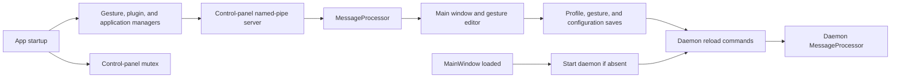

# Control panel
Active contributors: TransposonY

`GestureSign.ControlPanel` is the WPF editor for GestureSign's application profiles, gesture mappings, plugin commands, and settings. It loads shared configuration models, serves control-panel-side IPC, and starts the daemon when the main window opens and no daemon instance is running.

## Purpose

The control panel presents the persisted configuration through application, gesture, and options views, with dialogs for editing profiles and commands and importing or exporting configuration. It does not own input capture; it asks the daemon to reload changed data over named pipes. See [Application-aware actions](../../features/application-aware-actions.md) for how configured profiles are applied at runtime.

## Directory layout

```text
GestureSign.ControlPanel/
├── Common/
├── Converters/
├── Defaults/
│   ├── Actions.gsa
│   └── Gestures.gest
├── Dialogs/
├── Flyouts/
├── Languages/
├── Localization/
├── Log/
├── MainWindowControls/
│   ├── AvailableActions.xaml/.cs
│   ├── AvailableGestures.xaml/.cs
│   ├── ContinuousGestures.xaml/.cs
│   ├── IgnoredApplications.xaml/.cs
│   └── Options.xaml/.cs
├── Properties/
├── Resources/       theme dictionary and images
├── UserControls/
├── ViewModel/
├── App.xaml/.cs
├── MainWindow.xaml/.cs
└── MessageProcessor.cs
```

## Important types

| Abstraction | Responsibility |
| --- | --- |
| `App` (`GestureSign.ControlPanel/App.xaml.cs`) | Loads localization and shared managers, enforces a single control-panel instance, starts the panel-side pipe server, and wires save events to daemon reload commands. |
| `MainWindow` (`GestureSign.ControlPanel/MainWindow.xaml.cs`) | Hosts the six tabs, provides import/export and search chrome, and starts the daemon when the window loads if it is absent. |
| `AvailableActions` (`GestureSign.ControlPanel/MainWindowControls/AvailableActions.cs`) | Edits application entries and their actions; applies the action-list search and finger-count filters, manages action bindings, and saves changes. |
| `ActionListFilter` (`GestureSign.ControlPanel/ViewModel/ActionListFilter.cs`) | Tokenizes search text and matches it against prepared action text; matches either a gesture pattern's stroke count or a bound continuous gesture's contact count. |
| `ContinuousGestures` and `ContinuousGestureDialog` (`GestureSign.ControlPanel/MainWindowControls/ContinuousGestures.cs`, `GestureSign.ControlPanel/Dialogs/ContinuousGestureDialog.xaml.cs`) | Browse and edit the shared continuous-gesture catalog and the application actions bound to each entry. |
| `AvailableGestures`, `IgnoredApplications`, and `Options` (`GestureSign.ControlPanel/MainWindowControls/AvailableGestures.cs`, `GestureSign.ControlPanel/MainWindowControls/IgnoredApplications.cs`, `GestureSign.ControlPanel/MainWindowControls/Options.cs`) | Present gesture patterns, ignored-application rules, and general configuration settings. |
| `Archive` and `ExportImportDialog` (`GestureSign.ControlPanel/Common/Archive.cs`, `GestureSign.ControlPanel/Dialogs/ExportImportDialog.xaml.cs`) | Serialize or import selected application profiles, related gestures, and continuous-gesture catalog entries. |
| `MessageProcessor` (`GestureSign.ControlPanel/MessageProcessor.cs`) | Handles panel-side IPC, including daemon exit requests and newly captured gesture patterns. |

## How it works

During application startup, `App` opens logging and loads localization before creating the control-panel mutex. The first instance loads gesture, plugin, and application data, starts the control-panel pipe server, and attaches save handlers that request daemon reloads. It then creates the main window. On window load, `MainWindow` checks for the daemon executable and probes the daemon mutex; if no instance exists, it starts the daemon (using the `runas` verb when the current user is an administrator). Repeated control-panel launches try to foreground the existing window and then shut down.

The localized tabs in `GestureSign.ControlPanel/MainWindow.xaml` are Actions, Ignored Applications, Gestures, Continuous Gestures, Options, and About. The Actions view presents application profiles beside their actions in a redesigned ribbon-style editor. The action-list search is visible only on that tab; its whitespace-separated terms must all match prepared action text (action and gesture names, gesture/trigger details, command name and description, command settings, or plugin class). Matching is case-insensitive and ignores spaces within the indexed text. Finger chips (`All`, `1`–`5`, `6+`) match either the assigned gesture's stroke count or its bound continuous gesture's contact count. Search and finger filters affect the action list, not the application list. The UI palette, blue tab/title chrome, ribbon controls, and shared layout styles are in `GestureSign.ControlPanel/Resources/Theme.xaml`. The Continuous Gestures view lists catalog entries by contact count and direction, including the actions using each entry; its dialog creates or edits entries and binds or unbinds actions. The other configuration views are implemented in `MainWindowControls`.



When a profile, gesture, continuous gesture, or configuration save event fires, `App` sends `LoadApplications`, `LoadGestures`, `LoadContinuousGestures`, or `LoadConfiguration` to the daemon. In training mode, the daemon sends a `GotGesture` payload back; the control-panel processor converts its point arrays into patterns and raises `GotNewPattern` for UI subscribers. `Exit` is also handled by the control-panel processor. For the daemon side and process relationship see [Daemon](../daemon/index.md) and [Architecture](../../overview/architecture.md).

## Integration points

- The panel uses managers and persisted models from `GestureSign.Common`, including its named-pipe transport. See [Common library](../../libraries/common.md).
- `GestureSign.ControlPanel/Defaults/Actions.gsa` and `GestureSign.ControlPanel/Defaults/Gestures.gest` are included as output content by the project file.
- The project targets .NET 10 Windows and includes `uiAccessRelease`, `Centennial`, and `Portable` build configurations. `Centennial` defines `ConvertedDesktopApp`. If `AppConfig.UiAccess` is set on Windows 10 or later, `App` checks for the Store package and launches its app entry point if it finds one.
- Build setup and framework context are summarized in [Tooling](../../how-to-contribute/tooling.md).

## Modification entry points

- For startup, single-instance behavior, manager loading, localization, or IPC save subscriptions, start with `GestureSign.ControlPanel/App.xaml.cs`.
- For tab composition, title-bar actions, tab-strip search, and status bar, start with `GestureSign.ControlPanel/MainWindow.xaml`; event handlers and daemon launch logic are in `GestureSign.ControlPanel/MainWindow.xaml.cs`.
- For the Actions ribbon, profile/action editor, or filter behavior, start with `GestureSign.ControlPanel/MainWindowControls/AvailableActions.xaml`, `GestureSign.ControlPanel/MainWindowControls/AvailableActions.cs`, and `GestureSign.ControlPanel/ViewModel/ActionListFilter.cs`. Global palette and ribbon styling are in `GestureSign.ControlPanel/Resources/Theme.xaml`.
- For gesture, continuous-gesture, and ignored-application views, start with `GestureSign.ControlPanel/MainWindowControls/AvailableGestures.xaml`, `GestureSign.ControlPanel/MainWindowControls/ContinuousGestures.xaml` and `GestureSign.ControlPanel/Dialogs/ContinuousGestureDialog.xaml`, and `GestureSign.ControlPanel/MainWindowControls/IgnoredApplications.xaml`.
- For settings controls, start with `GestureSign.ControlPanel/MainWindowControls/Options.xaml` and `GestureSign.ControlPanel/MainWindowControls/Options.cs`.
- For archive import/export, start with `GestureSign.ControlPanel/Dialogs/ExportImportDialog.xaml.cs` and `GestureSign.ControlPanel/Common/Archive.cs`.
- For pipe messages received by this process, start with `GestureSign.ControlPanel/MessageProcessor.cs`; commands sent to the daemon are wired in `GestureSign.ControlPanel/App.xaml.cs`.

## Key source files

| Path | Role |
| --- | --- |
| `GestureSign.ControlPanel/MainWindow.xaml` | Main window layout and the six configuration/information tabs. |
| `GestureSign.ControlPanel/MainWindow.xaml.cs` | Window load behavior, including daemon startup and feedback actions. |
| `GestureSign.ControlPanel/Resources/Theme.xaml` | Shared blue-and-neutral color palette, title/tab styling, ribbon controls, and list-section styles. |
| `GestureSign.ControlPanel/MainWindowControls/AvailableActions.xaml` | Action tab layout, application list, and action assignment controls. |
| `GestureSign.ControlPanel/MainWindowControls/AvailableActions.cs` | Application/action editor behavior. |
| `GestureSign.ControlPanel/ViewModel/ActionListFilter.cs` | Reusable text-token and gesture-contact-count matching rules. |
| `GestureSign.ControlPanel/MainWindowControls/ContinuousGestures.xaml` | Continuous gesture catalog view. |
| `GestureSign.ControlPanel/Dialogs/ContinuousGestureDialog.xaml.cs` | Creates and edits a continuous gesture and its action bindings. |
| `GestureSign.ControlPanel/MainWindowControls/AvailableGestures.xaml` | Gesture management view. |
| `GestureSign.ControlPanel/MainWindowControls/IgnoredApplications.xaml` | Ignored-application view. |
| `GestureSign.ControlPanel/MainWindowControls/Options.xaml` | General options view. |
| `GestureSign.ControlPanel/MessageProcessor.cs` | Handles control-panel-side IPC messages. |
| `GestureSign.ControlPanel/Common/Archive.cs` | Reads and writes configuration archives. |
| `GestureSign.ControlPanel/Dialogs/ExportImportDialog.xaml.cs` | Import/export selection and merge behavior. |
| `GestureSign.ControlPanel/Defaults/Actions.gsa` | Default action configuration copied to build output. |
| `GestureSign.ControlPanel/Defaults/Gestures.gest` | Default gesture configuration copied to build output. |
| `GestureSign.ControlPanel/GestureSign.ControlPanel.csproj` | Defines framework, build configurations, XAML and content items, and project references. |
