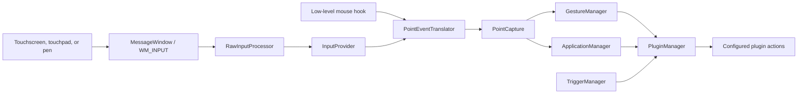

# Daemon

Active contributors: TransposonY

## Purpose

`GestureSign.Daemon` is a .NET 10 Windows Forms background process that captures touch, pen, and configured mouse input, then connects captured strokes to gesture recognition and plugin actions. It also owns trigger handling, the tray icon, gesture-training IPC, and the optional drawing surface.

## Directory layout

```text
GestureSign.Daemon/
├── Filtration/      UIAccess pointer-input filtering
├── Input/           WM_INPUT, HID device adapters, translation, and capture
├── Native/          Win32, raw-input, pointer, and HID declarations
├── Properties/      resources and application manifests
├── Surface/         visual feedback overlay
├── Triggers/        hotkey, mouse, and continuous-gesture triggers
├── MessageProcessor.cs
├── Program.cs
└── TrayManager.cs
```

## Key abstractions

| Abstraction | Source | Responsibility |
| --- | --- | --- |
| `Program` | `GestureSign.Daemon/Program.cs` | Enforces a single daemon instance and initializes capture, managers, plugins, tray UI, and the named-pipe server. |
| `MessageWindow` and `RawInputProcessor` | `GestureSign.Daemon/Input/MessageWindow.cs`, `GestureSign.Daemon/Input/RawInputProcessor.cs` | Receives `WM_INPUT`, decodes digitizer reports, and arbitrates between touch, touchpad, and pen input. |
| `InputProvider` and `PointEventTranslator` | `GestureSign.Daemon/Input/InputProvider.cs`, `GestureSign.Daemon/Input/PointEventTranslator.cs` | Connect raw frames and the low-level mouse hook to normalized point-down, move, and up events. |
| `HidDevice`, `TouchScreenDevice`, `TouchPadDevice`, and `PenDevice` | `GestureSign.Daemon/Input/HidDevice.cs`, `GestureSign.Daemon/Input/TouchScreenDevice.cs`, `GestureSign.Daemon/Input/TouchPadDevice.cs`, `GestureSign.Daemon/Input/PenDevice.cs` | Read HID contact, button, and coordinate data for supported digitizer types. |
| `PointCapture` | `GestureSign.Daemon/Input/PointCapture.cs` | Owns capture mode and state, collects strokes, and raises lifecycle and recognition events. |
| `IInputSettings` and `ICaptureHost` | `GestureSign.Daemon/Input/InputSettings.cs`, `GestureSign.Daemon/Input/CaptureHost.cs` | Separate live settings and operating-system effects from the input and capture logic. Tests can supply fixed settings and a fake host. |
| `TouchPadTapClicker` | `GestureSign.Daemon/Input/TouchPadTapClicker.cs` | Converts a qualifying quick, still, single-finger touchpad tap into a primary mouse click when configured. |
| `TriggerManager` and `ContinuousGestureTrigger` | `GestureSign.Daemon/Triggers/TriggerManager.cs`, `GestureSign.Daemon/Triggers/ContinuousGestureTrigger.cs` | Installs trigger handlers and routes recognized continuous movements to the shared action executor. |
| `MessageProcessor` | `GestureSign.Daemon/MessageProcessor.cs` | Applies control-panel IPC commands on the daemon's synchronization context. |
| `PointerInputTargetWindow` | `GestureSign.Daemon/Filtration/PointerInputTargetWindow.cs` | Implements the optional UIAccess pointer-input filtering and touch-injection path. |
| `TrayManager` and `SurfaceForm` | `GestureSign.Daemon/TrayManager.cs`, `GestureSign.Daemon/Surface/SurfaceForm.cs` | Provide tray controls and the gesture-stroke visual feedback overlay. |

## How it works

`Program` creates the daemon mutex and, for the owning process, loads `PointCapture`, triggers, gesture and application managers, plugins, and the tray before starting the WinForms message loop (`GestureSign.Daemon/Program.cs`). The message-only window registers for digitizer input and passes each `WM_INPUT` buffer to the raw-input processor (`GestureSign.Daemon/Input/MessageWindow.cs`). `InputProvider` forwards decoded frames and mouse-hook events into the translator, which emits point events for `PointCapture`.

When a capture begins or completes, the shared managers determine the target application's profile and compare the collected strokes with configured gestures. `PluginManager` (`GestureSign.Common/Plugins/PluginManager.cs`) uses that context to run enabled actions for a recognized gesture. Hotkey, mouse, and continuous-gesture triggers take a separate route into the same action executor.



`GestureManager` (`GestureSign.Common/Gestures/GestureManager.cs`) subscribes to capture events and identifies the gesture name. `ApplicationManager` (`GestureSign.Common/Applications/ApplicationManager.cs`) resolves the foreground or target-window profile and the configured actions. Trigger handlers are loaded by `TriggerManager`; continuous gestures are catalogued by `ContinuousGestureManager` (`GestureSign.Common/Gestures/ContinuousGestureManager.cs`).

The [Architecture page](../../overview/architecture.md) describes the daemon's place in the wider process and project layout. For device decoding and stroke recognition details, see [Device gestures](../../features/device-gestures.md); trigger-specific behavior is covered in [Triggers](../../features/triggers.md).

## Integration points

- `GestureSign.Common` provides the application, gesture, plugin, configuration, and IPC contracts used by the daemon. See [Common library](../../libraries/common.md) for the shared models and managers.
- The WPF control panel sends daemon commands to start or stop training and reload application profiles, gestures, continuous gestures, or configuration. `MessageProcessor` dispatches these requests; completed training patterns are sent back with the `GotGesture` command. The [Control panel](../control-panel/index.md) page covers the other side of this process boundary.
- `InputProvider` also hosts a device-state pipe that returns enumerated HID devices. The separate `GestureSign.InputRecorder` project records raw input for reproducible testing; the daemon does not depend on the recorder.
- The named-pipe boundary is local IPC, not a network API. Review [Security](../../security.md) for the repository's IPC and plugin trust-boundary notes.

## Entry points for modification

For raw device registration, HID decoding, or source arbitration, begin with `GestureSign.Daemon/Input/MessageWindow.cs`, `GestureSign.Daemon/Input/RawInputProcessor.cs`, and the device adapters under `GestureSign.Daemon/Input/`. For event interpretation and stroke lifecycle changes, follow `GestureSign.Daemon/Input/PointEventTranslator.cs` into `GestureSign.Daemon/Input/PointCapture.cs`; recognition, profile selection, and plugin execution are implemented in the shared managers listed above. For IPC or trigger behavior, start with `GestureSign.Daemon/MessageProcessor.cs` or the relevant class under `GestureSign.Daemon/Triggers/`.

## Automated test coverage

The xUnit project (`GestureSign.Tests/GestureSign.Tests.csproj`) exercises the production raw-input decoder with synthetic HID reports (`GestureSign.Tests/Input/RawInputProcessorTests.cs`), capture and translation logic for touch, pen, and mouse (`GestureSign.Tests/Input/TouchAndPenCaptureTests.cs`, `GestureSign.Tests/Input/MouseCaptureTests.cs`), touchpad tap-to-click rules (`GestureSign.Tests/Input/TouchPadTapClickerTests.cs`), and recorded pipeline replays (`GestureSign.Tests/Replay/GoldenReplayTests.cs`). The tests use injected device/environment services and a fake capture host, so they cover logic without physical digitizers.

The automated suite does not exercise live `WM_INPUT` device registration, the real low-level mouse hook, or `PointerInputTargetWindow` registration and touch injection. In particular, the UIAccess filtering path depends on Windows pointer APIs and needs manual testing; the relevant implementation is in `GestureSign.Daemon/Filtration/PointerInputTargetWindow.cs` and the conditional setup is in `GestureSign.Daemon/Input/PointCapture.cs`.

## Key source files

| File | Purpose |
| --- | --- |
| `GestureSign.Daemon/Program.cs` | Single-instance startup and runtime initialization order. |
| `GestureSign.Daemon/Input/MessageWindow.cs` | Registers digitizer devices and receives raw input messages. |
| `GestureSign.Daemon/Input/RawInputProcessor.cs` | Decodes HID reports, selects the active device source, and emits raw point frames. |
| `GestureSign.Daemon/Input/RawInputSystemServices.cs` | Implements raw-device queries and samples screen/environment state. |
| `GestureSign.Daemon/Input/InputProvider.cs` | Connects decoded input, mouse hook, tap-click handling, device-state IPC, and system events. |
| `GestureSign.Daemon/Input/PointEventTranslator.cs` | Converts device frames and mouse events into normalized point events. |
| `GestureSign.Daemon/Input/PointCapture.cs` | Captures strokes, applies capture state and mode, and emits capture/recognition events. |
| `GestureSign.Daemon/Input/InputSettings.cs` | Exposes live application settings to the input pipeline. |
| `GestureSign.Daemon/Input/CaptureHost.cs` | Encapsulates capture-side operating-system effects behind an injectable interface. |
| `GestureSign.Daemon/Triggers/TriggerManager.cs` | Installs built-in trigger handlers and forwards fired actions. |
| `GestureSign.Daemon/MessageProcessor.cs` | Handles daemon-side named-pipe commands and manager reloads. |
| `GestureSign.Daemon/Filtration/PointerInputTargetWindow.cs` | Implements UIAccess pointer filtering and touch injection. |
| `GestureSign.Daemon/Surface/SurfaceForm.cs` | Draws the translucent gesture trail. |
| `GestureSign.Daemon/TrayManager.cs` | Implements the system-tray menu and control-panel launch. |
| `GestureSign.Daemon/GestureSign.Daemon.csproj` | Defines target framework, build configurations, manifests, and project references. |
