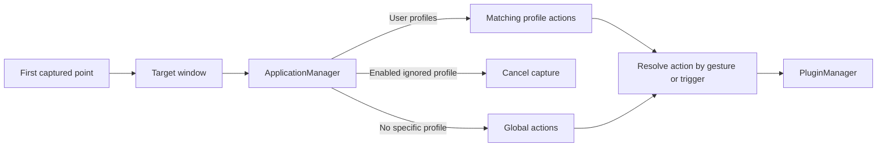

# Application-aware actions

Active contributors: TransposonY

GestureSign identifies the window associated with an input and matches it against configured user or ignored profiles. Matching actions are gathered from those profiles, with the global profile serving as fallback when no specific action applies.

## Profile matching

A user profile can match a window by executable filename, window title, or window class; the match string can be compared literally or as a regular expression. Several profiles can match the same window. `IgnoredApp` profiles use the same window-matching fields and can be enabled to cancel capture, while `GlobalApp` supplies actions that are not tied to a particular window.

At capture start, `ApplicationManager` identifies the window under the initial point and stores its matching profiles. For touchscreen and touchpad capture, the maximum finger limit from the recognized profiles is used to reject paths with too few contacts. An enabled ignored profile cancels capture. The global profile can also cancel a capture over a full-screen window when the corresponding option is enabled. User profiles can specify a touch-input blocking threshold when the UI-access capture path is active.

For actions marked to match the activated application, `ApplicationManager` can switch to the foreground window at the pre-action lookup stage when a matching user profile is found; otherwise it resolves the profile from the original capture point. Action lookup ignores ignored profiles. It gathers matching actions from recognized profiles and falls back to global actions if none of those profiles supplies a match. Hotkey registration also uses the current foreground profiles plus global actions; see [Triggers](triggers.md).

## Control-panel behavior

The Action page manages application profiles and their actions; the Ignored apps page manages ignored profiles. The application dialog edits match type and string, regex and activated-window options, and applicable profile settings such as finger limit and touch-input threshold. Profiles can also have an icon. The action list can be filtered by application and action text.

The profile manager owns matching and action lookup. `UserApp`, `IgnoredApp`, and `GlobalApp` supply profile-specific behavior. See [Plugin actions](plugin-actions.md) for command dispatch after an action has been selected and [Device gestures](device-gestures.md) for the capture point and input source.

## Key source files

| Source | Responsibility |
| --- | --- |
| `GestureSign.Common/Applications/ApplicationManager.cs` | Resolves windows and profiles, stores capture context, applies capture constraints, and looks up actions. |
| `GestureSign.Common/Applications/ApplicationBase.cs` | Common profile matching fields and action collection. |
| `GestureSign.Common/Applications/UserApp.cs` | User-profile options such as finger limit, touch threshold, and activated-window matching. |
| `GestureSign.Common/Applications/IgnoredApp.cs` | Defines enabled and disabled ignored-profile behavior. |
| `GestureSign.Common/Applications/GlobalApp.cs` | Defines the fallback profile and its finger limit. |
| `GestureSign.Common/Applications/MatchUsing.cs` | Defines executable, title, and window-class match strategies. |
| `GestureSign.ControlPanel/Dialogs/ApplicationDialog.xaml.cs` | Edits profiles, match criteria, and profile-specific settings. |
| `GestureSign.ControlPanel/MainWindowControls/AvailableActions.cs` | Implements user-profile and action-list interactions. |
| `GestureSign.ControlPanel/MainWindowControls/IgnoredApplications.cs` | Implements ignored-profile management. |
| `GestureSign.Daemon/Input/PointCapture.cs` | Raises capture-start and pre-action events used to establish profile context. |

## Related pages

[Device gestures](device-gestures.md) explains input capture; [Triggers](triggers.md) covers independent action triggers; [Plugin actions](plugin-actions.md) follows the selected action into plugin execution. See [Common library](../libraries/common.md) for shared application models.
