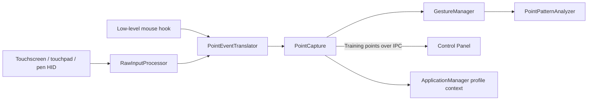

# Device gestures

Active contributors: TransposonY

GestureSign decodes touchscreen, touchpad, and pen HID reports alongside low-level mouse input, then captures pointer paths for gesture matching. The capture pipeline also supports training, configurable pen and mouse drawing input, and optional touchpad tap-to-click.

## Input and capture flow

`InputProvider` receives raw-input frames and maintains the low-level mouse hook. `RawInputProcessor` validates digitizer devices, decodes touchpad, touchscreen, and pen reports into point frames, maps digitizer coordinates to the screen, and arbitrates the active device. `PointEventTranslator` turns those frames and mouse-hook events into point-down, move, and up events. Mouse drawing uses the configured drawing button; pen capture uses the selected pen state (tip, hover, eraser/invert, or side button) from Options.

`PointCapture` collects the strokes, reports capture lifecycle events, and provides visual feedback. It separates its lifecycle state from capture mode: Normal captures for recognition, Training sends captured patterns to the Control Panel, and UserDisabled leaves input available to the rest of the system without normal gesture actions. Capture-start subscribers can cancel a path before recognition, including for ignored application profiles or touch-finger limits.

## Gesture matching and training

`GestureManager` compares the captured stroke arrays against saved samples using `PointPatternAnalyzer`. Candidates must have the same stroke count; each stroke must score above the manager's 80 probability threshold. Multi-step patterns are matched in order: a subsequent stroke continues from the previous candidates, with an 800 ms inter-step timeout. The pattern library interpolates points and compares their angular changes.

In Training mode, `PointCapture` sends completed point arrays to the Control Panel, which can save them as a named gesture sample. The Gestures page also supports editing, deleting, and importing standalone `.gest` files. See [Import and export](import-export.md) for profile archives and backups.

## Touchpad tap-to-click

The Options setting for touchpad tap-to-click enables `TouchPadTapClicker` on raw touchpad frames. It simulates a primary click on release for a single-contact tap lasting no more than 250 ms and moving no more than 2.5% of the current screen extent on either axis. A second contact or a physical touchpad button press disqualifies the tap, so multi-contact input remains available for gesture capture. The setting is independent of path recognition.

## Key source files

| Source | Responsibility |
| --- | --- |
| `GestureSign.Daemon/Input/InputProvider.cs` | Receives raw-input frames, configures the mouse hook, and gates optional tap-to-click processing. |
| `GestureSign.Daemon/Input/RawInputProcessor.cs` | Validates and decodes HID touch and pen data, maps coordinates, and arbitrates device ownership. |
| `GestureSign.Daemon/Input/TouchPadTapClicker.cs` | Applies single-contact tap duration, movement, and button rules before simulating a primary click. |
| `GestureSign.Daemon/Input/PointEventTranslator.cs` | Converts raw frames and mouse-hook events into capture point events. |
| `GestureSign.Daemon/Input/PointCapture.cs` | Captures strokes, manages modes and lifecycle, and dispatches training and recognition callbacks. |
| `GestureSign.Common/Input/Devices.cs` | Defines input-device flags used by capture and action filtering. |
| `GestureSign.Common/Input/CaptureMode.cs` | Defines Normal, Training, and UserDisabled modes. |
| `GestureSign.Common/Input/CaptureState.cs` | Defines capture lifecycle states. |
| `GestureSign.Common/Gestures/GestureManager.cs` | Loads samples and matches single- and multi-step gestures. |
| `GestureSign.PointPatterns/PointPatternAnalyzer.cs` | Scores captured stroke patterns against stored patterns. |
| `GestureSign.PointPatterns/PointPatternMath.cs` | Implements point interpolation and angular comparison helpers. |
| `GestureSign.ControlPanel/MainWindowControls/AvailableGestures.cs` | Provides gesture-list editing and standalone `.gest` import. |
| `GestureSign.ControlPanel/Dialogs/GestureDefinition.xaml.cs` | Edits and saves named gesture samples. |
| `GestureSign.Daemon/MessageProcessor.cs` | Handles IPC commands for starting and stopping gesture training. |

## Related pages

[Application-aware actions](application-aware-actions.md) describes profile lookup after capture. [Triggers](triggers.md) covers non-path triggers. [Import and export](import-export.md) covers gesture files, profile archives, and backups.
