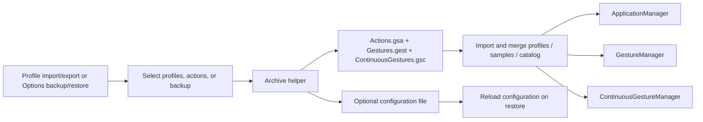

# Import and export

Active contributors: TransposonY

GestureSign imports standalone gesture samples and application/action files, and it exports selected profiles with the gesture data they reference. The Options page creates and restores full backups containing all profiles, gestures, the continuous-gesture catalog, and configuration.

## File formats and workflows

- **`.gest`** — gesture samples. The Gestures page imports them from a file picker or drag-and-drop.
- **`.gsa`** — serialized application profiles and actions. The Action and Ignored apps pages accept these files by drag-and-drop; the Download window also opens them through its import selector.
- **`.ges`** — profile archive. It contains `Actions.gsa`, `Gestures.gest`, and `ContinuousGestures.gsc`. Export lets users select profiles and actions; the archive includes the gesture samples and continuous-gesture entries referenced by those selections. Profile export does not include configuration.
- **`.gsb`** — full backup created by Options. It includes all current profiles, gesture samples, the continuous-gesture catalog, and the configuration file. Restore reloads the archived configuration when present and replaces the available profile and gesture collections from the backup.

The archive helper accepts an optional configuration path, but the profile export dialog does not pass one. Older `.ges`/`.gsa` data may have continuous gestures embedded in actions rather than a separate catalog; archive and profile import migrate those values to catalog entries.

## Import and merge behavior

For profile exports, related path samples are collected from selected action gesture names, and related continuous motions from their catalog names. During profile import, similar gesture samples reuse the local gesture name and update related action references; a conflicting name with no similar sample is replaced by a fresh name. Continuous motions that already exist locally map to the existing entry, while a name collision for a new motion receives a generated name and updates imported references.

Non-ignored imported profiles with the same match strategy and match string as an existing non-ignored profile have their actions appended. Otherwise they are added as profiles. An ignored profile with an existing match strategy and string is not duplicated. Import is a merge, not a full replacement; restore from a `.gsb` backup is the replacement workflow.

Standalone `.gest` import adds samples without associated application actions. The Action and Ignored apps import workflows can load `.gsa` profiles directly or `.ges` archives with associated gesture/catalog data. See [Device gestures](device-gestures.md) for gesture samples and [Application-aware actions](application-aware-actions.md) for profile data.

## Backup and restore

Options creates a `.gsb` archive from the complete current application list, gesture list, continuous catalog, and `AppConfig.ConfigPath`. Restore copies the archived config over the current one when included, reloads settings, loads and replaces gesture samples and continuous entries when present, then replaces the application profiles when the backup contains them. The archive reader also migrates legacy embedded continuous gestures before loading the resulting catalog.

## Key source files

| Source | Responsibility |
| --- | --- |
| `GestureSign.ControlPanel/Common/Archive.cs` | Creates and extracts profile, gesture, continuous-catalog, and optional configuration archive entries. |
| `GestureSign.ControlPanel/Dialogs/ExportImportDialog.xaml.cs` | Runs profile export/import and merges profiles, actions, gestures, and catalog references. |
| `GestureSign.ControlPanel/UserControls/ApplicationSelector.xaml.cs` | Selects profiles, actions, ignored profiles, and associated gesture samples. |
| `GestureSign.ControlPanel/MainWindowControls/AvailableGestures.cs` | Imports standalone `.gest` files. |
| `GestureSign.ControlPanel/MainWindowControls/AvailableActions.cs` | Handles profile/archive drag-and-drop and launches profile import/export. |
| `GestureSign.ControlPanel/MainWindowControls/IgnoredApplications.cs` | Handles ignored-profile import/export workflows. |
| `GestureSign.ControlPanel/MainWindowControls/Options.cs` | Creates full backups and restores profiles, samples, catalogs, and configuration. |
| `GestureSign.Common/Extensions/GestureExtensions.cs` | Matches imported samples and updates action gesture-name references. |
| `GestureSign.Common/Extensions/ApplicationExtensions.cs` | Finds referenced gesture/catalog entries and updates continuous-gesture references. |
| `GestureSign.Common/Constants.cs` | Defines the file names and extensions for the data formats. |
| `GestureSign.Common/Gestures/ContinuousGestureManager.cs` | Merges catalog entries and migrates pre-catalog action data. |

## Related pages

[Device gestures](device-gestures.md) covers sample capture and standalone gesture files; [Triggers](triggers.md) explains the continuous-gesture catalog; [Application-aware actions](application-aware-actions.md) describes the profiles that are imported. See the [Control Panel app page](../apps/control-panel/index.md) for the corresponding screens.
