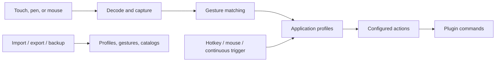

# Features

Active contributors: TransposonY

These pages describe GestureSign through the behaviors users configure and experience. They follow input from device decoding and gesture matching through profile selection, triggers, plugin actions, and data transfer.

## Feature pages

- [Device gestures](device-gestures.md) — decode touchpad, touchscreen, pen, and mouse input; capture and match paths; optional touchpad tap-to-click.
- [Application-aware actions](application-aware-actions.md) — match target windows to user, ignored, or global profiles and resolve actions.
- [Plugin actions](plugin-actions.md) — author and execute ordered commands supplied by built-in or extra plugins.
- [Triggers](triggers.md) — fire actions from hotkeys, mouse buttons or wheel, and continuous directional movement.
- [Import and export](import-export.md) — transfer gesture samples, profiles, continuous-gesture catalogs, and full backups.

## Runtime path

A drawn gesture is decoded and captured before it is matched; the target window determines which profile actions are considered. Hotkey, mouse, and continuous-motion triggers can also select actions without a completed named path. Both routes reach the shared plugin action executor.

For the broader runtime component map, see [Architecture](../overview/architecture.md). User-facing control-panel entry points are summarized in the [Control Panel app page](../apps/control-panel/index.md); shared data structures are covered by the [Common library page](../libraries/common.md).
