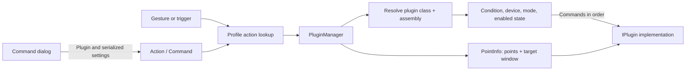

# Plugin actions

Active contributors: TransposonY

An action stores an ordered list of commands, each linked to a plugin implementation and its serialized settings. The plugin manager resolves enabled commands, applies action and device rules, and invokes each plugin with the captured points and target-window context.

## Action and command data

`Action` combines the optional gesture name, condition, window-activation preference, device exclusions, trigger fields, and command list. Each `Command` stores a display name, plugin class and assembly filename, serialized settings, and enabled state. In the Control Panel, the Command dialog lists plugins marked as actions, hosts any plugin-provided settings UI, and serializes the selected plugin's settings into the command.

Plugins implement `IPlugin`. At startup, `PluginManager` loads implementations from `GestureSign.CorePlugins.dll` and DLL files in the `Plugins` directory, supplies host services, initializes each plugin, and registers its class and filename for command resolution.

## Runtime execution

A blank action condition passes. Otherwise, the executor substitutes per-contact start/end coordinates and contact IDs in the condition expression before evaluating it; coordinate variables also have percentage forms. A failed expression prevents the action's commands from running. Actions configured to ignore the current input device are skipped. Training mode does not execute actions; in UserDisabled mode, only the core toggle-disable command is permitted.

Enabled commands run in their stored order. The executor waits for the target window to become idle, resolves the plugin by class and filename, deserializes its command settings, and calls the plugin with a `PointInfo` that includes the captured points and target window. The first enabled command can activate that window according to the action override or the plugin default. New action execution is chained after the previous action task.

Gesture matches reach the executor through `PluginManager`'s gesture-recognition callback. Hotkey, mouse, and continuous-motion triggers reach it through `TriggerManager`. Read [Application-aware actions](application-aware-actions.md) for profile selection and [Triggers](triggers.md) for non-gesture entry points.

## Key source files

| Source | Responsibility |
| --- | --- |
| `GestureSign.Common/Applications/Action.cs` | Stores action trigger fields, condition, device exclusions, and ordered commands. |
| `GestureSign.Common/Applications/Command.cs` | Stores plugin reference, settings payload, display name, and enabled state. |
| `GestureSign.Common/Applications/ICommand.cs` | Defines the command data contract. |
| `GestureSign.Common/Plugins/IPlugin.cs` | Defines the plugin contract and its settings and execution hooks. |
| `GestureSign.Common/Plugins/PluginManager.cs` | Discovers plugins, resolves commands, evaluates conditions, and executes actions. |
| `GestureSign.Common/Plugins/PluginInfo.cs` | Wraps plugin metadata used for command lookup. |
| `GestureSign.Common/Plugins/HostControl.cs` | Exposes host managers and capture services to plugins. |
| `GestureSign.Common/Plugins/PointInfo.cs` | Carries point and window context to plugin implementations. |
| `GestureSign.ControlPanel/Dialogs/CommandDialog.xaml.cs` | Selects plugins and serializes their settings. |
| `GestureSign.ControlPanel/Dialogs/ActionDialog.xaml.cs` | Edits action-level settings, hotkeys, mouse triggers, and device filters. |
| `GestureSign.ControlPanel/MainWindowControls/AvailableActions.cs` | Creates, edits, orders, enables, and removes action commands. |
| `GestureSign.Daemon/Program.cs` | Initializes plugin and host services in the daemon. |
| `GestureSign.Daemon/Triggers/TriggerManager.cs` | Routes non-gesture trigger actions to the shared plugin executor. |

## Related pages

[Application-aware actions](application-aware-actions.md) covers profile lookup; [Triggers](triggers.md) covers how independent triggers reach action execution. The [Common library](../libraries/common.md) documents shared contracts, while [Core plugins](../libraries/core-plugins.md) describes built-in plugin implementations.
