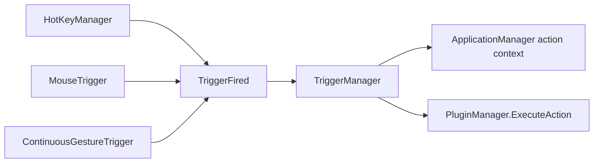

# Triggers

Active contributors: TransposonY

Triggers execute configured actions without requiring a completed named gesture match. GestureSign installs handlers for keyboard hotkeys, mouse buttons and wheel events, and continuous directional movement during a captured path.

## Trigger types

- **Hotkeys:** `HotKeyManager` registers hotkeys from the foreground window's matching user profiles and from global actions. It refreshes registrations when foreground profiles change and unloads hotkeys in UserDisabled mode.
- **Mouse buttons and wheel:** `MouseTrigger` listens to the low-level mouse hook while mouse drawing is the active input source and capture is pending or a trigger has fired. A matching button action is dispatched on button-up (the matching down event is handled); wheel direction is dispatched from the wheel event.
- **Continuous gestures:** `ContinuousGestureTrigger` observes captured points while capture is active. It compares the average movement direction and contact count against entries in the separate continuous-gesture catalog, then fires bound actions according to the movement rate.

All three handlers are installed by `TriggerManager`. When actions fire, the manager packages the trigger point and sends them through the shared plugin executor. Trigger lookup uses the current recognized profile context, with global actions available as fallback. Hotkey dispatch uses the foreground profile context. The executor still applies action conditions, device exclusions, and mode rules; see [Plugin actions](plugin-actions.md).

## Continuous-gesture catalog

Continuous gestures are catalog entries with a name, contact count, and direction, stored in `ContinuousGestures.gsc`. Actions refer to entries by `ContinuousGestureName`; these entries are separate from the saved path samples in `Gestures.gest`. Users create, edit, delete, and bind entries in the Control Panel's Continuous Gestures tab. The ordinary action dialog edits hotkey and mouse fields but does not edit continuous-gesture bindings.

The control panel saves catalog updates and notifies the daemon with `LoadContinuousGestures` IPC so its catalog copy can reload. Legacy action files that embedded a continuous motion are migrated into catalog entries and name references when applications or archives are loaded. Importing entries maps identical motions to an existing local entry, and renames colliding names for new motions while updating related action references. See [Import and export](import-export.md) for how archives carry the catalog.

## Key source files

| Source | Responsibility |
| --- | --- |
| `GestureSign.Daemon/Triggers/TriggerManager.cs` | Constructs trigger handlers and routes their actions to plugin execution. |
| `GestureSign.Daemon/Triggers/Trigger.cs` | Defines the shared trigger event base. |
| `GestureSign.Daemon/Triggers/TriggerFiredEventArgs.cs` | Carries fired actions and the trigger point. |
| `GestureSign.Daemon/Triggers/HotKeyManager.cs` | Registers and dispatches foreground-contextual hotkeys. |
| `GestureSign.Daemon/Triggers/MouseTrigger.cs` | Matches mouse button and wheel events to actions. |
| `GestureSign.Daemon/Triggers/ContinuousGestureTrigger.cs` | Detects contact count and movement direction during path capture. |
| `GestureSign.Common/Applications/Action.cs` | Stores hotkey, mouse, continuous-gesture reference, and device-exclusion fields. |
| `GestureSign.Common/Gestures/ContinuousGesture.cs` | Defines a catalog entry with name, contact count, and direction. |
| `GestureSign.Common/Gestures/ContinuousGestureManager.cs` | Loads, saves, migrates, and merges continuous-gesture entries. |
| `GestureSign.ControlPanel/MainWindowControls/ContinuousGestures.cs` | Implements catalog creation, editing, and deletion in the Control Panel. |
| `GestureSign.ControlPanel/Dialogs/ActionDialog.xaml.cs` | Edits action hotkey, mouse, condition, and device options. |
| `GestureSign.ControlPanel/App.xaml.cs` | Notifies the daemon after catalog save. |
| `GestureSign.Daemon/MessageProcessor.cs` | Handles catalog reload IPC. |
| `GestureSign.Common/Plugins/PluginManager.cs` | Executes actions selected by trigger handlers. |

## Related pages

[Device gestures](device-gestures.md) describes the captured input path that continuous triggers observe. [Application-aware actions](application-aware-actions.md) explains profile lookup, and [Plugin actions](plugin-actions.md) covers shared execution.
