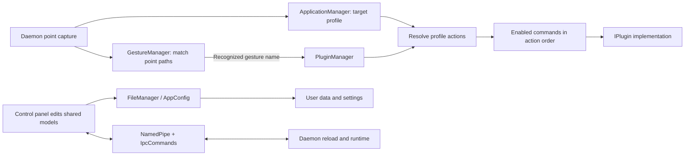

# Common
Active contributors: TransposonY

`GestureSign.Common` is the shared application and runtime library used across GestureSign. It defines application/action models, gesture managers, configuration and JSON persistence, localization, per-user named-pipe IPC, and the plugin contracts and manager. The daemon and control panel work against these shared models rather than maintaining separate representations of profiles, gestures, or plugin commands.

## Directory layout

| Area | Contents |
| --- | --- |
| `GestureSign.Common/Applications/` | Application profiles and matching, actions and commands, manager logic, and legacy model conversion |
| `GestureSign.Common/Gestures/` | Drawn-gesture samples and recognition manager, plus the named continuous-gesture catalog |
| `GestureSign.Common/Configuration/` | User settings, storage-path selection, JSON serialization, and file coordination |
| `GestureSign.Common/InterProcessCommunication/` | Named-pipe client/server support and the shared IPC command enum |
| `GestureSign.Common/Localization/` | Culture selection and lookup of language text from assemblies or language files |
| `GestureSign.Common/Plugins/` | Plugin contracts, host context, metadata, loading, and action dispatch |
| `GestureSign.Common/Input/` | Capture interfaces, device and mode values, and shared input event data |
| `GestureSign.Common/Extensions/`, `GestureSign.Common/Exceptions/`, `GestureSign.Common/Log/`, `GestureSign.Common/UI/` | Shared helpers, exception types, logging, and UI support |

## Key abstractions

| Abstraction | Role |
| --- | --- |
| `GestureSign.Common/Applications/ApplicationBase.cs`, `GestureSign.Common/Applications/Action.cs`, `GestureSign.Common/Applications/Command.cs` | Represent application profiles, the actions configured for them, and the ordered plugin commands that an action can invoke |
| `GestureSign.Common/Applications/ApplicationManager.cs` | Loads and saves profiles, matches target windows, selects recognized profiles, and resolves actions with global fallback |
| `GestureSign.Common/Gestures/GestureManager.cs` | Loads and matches drawn gesture samples, including multi-step point-pattern matches |
| `GestureSign.Common/Gestures/ContinuousGesture.cs`, `GestureSign.Common/Gestures/ContinuousGestureManager.cs` | Define named continuous motions and catalog loading, saving, migration, and import/merge operations |
| `GestureSign.Common/Configuration/AppConfig.cs`, `GestureSign.Common/Configuration/FileManager.cs` | Expose persisted preferences and data paths; serialize shared data as JSON and coordinate file access |
| `GestureSign.Common/InterProcessCommunication/NamedPipe.cs`, `GestureSign.Common/InterProcessCommunication/IpcCommands.cs` | Name pipes for the current Windows user and define commands exchanged between processes |
| `GestureSign.Common/Plugins/IPlugin.cs`, `GestureSign.Common/Plugins/PluginManager.cs` | Define the plugin lifecycle and discover, initialize, resolve, and execute plugin implementations |
| `GestureSign.Common/Localization/LocalizationProvider.cs` | Load localized text from registered assemblies or language files, using the configured/current UI culture and English fallback |

## Runtime flow

The capture implementation supplies point events to the shared managers. The application manager identifies the target window and matching profile context; the gesture manager matches captured point paths against saved samples. On recognition, the plugin manager obtains configured actions, checks their conditions and device/mode restrictions, resolves enabled commands, then invokes the corresponding plugin.

`GestureManager` is for drawn point-pattern gestures. Continuous motions use a separate catalog: an action stores a `ContinuousGestureName` reference, while `ContinuousGestureManager` owns the named motion definitions. The daemon and control panel load their own catalog instances from persisted data; process coordination uses the IPC layer.

## Persistence and compatibility

`AppConfig` selects application-data and configuration paths. Standard builds use the user's roaming and local application-data folders; portable builds use an `AppData` directory beside the application. `FileManager` reads and writes JSON, optionally including type names for polymorphic application/action data, and coordinates reads/writes with backup paths. The application and gesture managers try their persisted data and backup locations before their respective legacy/default fallbacks.

The current application loader also migrates legacy action-embedded continuous gestures. Old action JSON can deserialize its `ContinuousGesture` property into the compatibility shape in `GestureSign.Common/Applications/Action.cs`; `GestureSign.Common/Applications/ApplicationManager.cs` waits for the catalog's initial load and calls `ContinuousGestureManager.AdoptLegacy`. `GestureSign.Common/Gestures/ContinuousGestureManager.cs` delegates to `ContinuousGestureCatalog.MigrateLegacy`: for valid motions (2–10 contacts and a defined direction), it reuses a catalog entry with the same motion or creates one, then replaces the embedded value with the action's `ContinuousGestureName`. Invalid legacy values are discarded, and an action that already has a catalog reference keeps it. If the catalog grows it is saved; if any embedded value was removed, the application data is saved as well.

## Integration points

- `GestureSign.Daemon` supplies the live capture events and uses the shared application, gesture, and plugin managers to select and execute configured behavior.
- `GestureSign.ControlPanel` edits the shared application, action, gesture, and continuous-gesture models and persists changes through the shared configuration layer.
- `GestureSign.CorePlugins` and optional plugin assemblies implement `IPlugin`; `PluginManager` discovers the core assembly and DLLs in the runtime `Plugins` directory.
- `GestureSign.PointPatterns` provides point-pattern comparison used by `GestureManager`.
- `NamedPipe.GetUserPipeName` appends the current Windows user's SID to the pipe name. `IpcCommands` provides the command identifiers (including configuration, application, gesture, and continuous-gesture reload operations); update sender and receiver behavior together when changing this protocol.

## Modification entry points

| Change | Start here |
| --- | --- |
| Add or change profile/action/command data | `GestureSign.Common/Applications/ApplicationBase.cs`, `GestureSign.Common/Applications/Action.cs`, `GestureSign.Common/Applications/Command.cs`; follow with `GestureSign.Common/Applications/ApplicationManager.cs` for matching and persistence |
| Change drawn-gesture recognition or saved samples | `GestureSign.Common/Gestures/GestureManager.cs`; point comparison itself is in `GestureSign.PointPatterns/` |
| Change continuous-gesture definitions, persistence, or legacy adoption | `GestureSign.Common/Gestures/ContinuousGesture.cs`, `GestureSign.Common/Gestures/ContinuousGestureManager.cs`, and the application-load path in `GestureSign.Common/Applications/ApplicationManager.cs` |
| Add a preference or change the data/config path | `GestureSign.Common/Configuration/AppConfig.cs`; use `GestureSign.Common/Configuration/FileManager.cs` for JSON-backed data |
| Add/change daemon-control-panel messages | `GestureSign.Common/InterProcessCommunication/IpcCommands.cs`, `GestureSign.Common/InterProcessCommunication/NamedPipe.cs`, and the corresponding process-side message handlers |
| Change plugin discovery or dispatch | `GestureSign.Common/Plugins/IPlugin.cs`, `GestureSign.Common/Plugins/PluginManager.cs`, and the plugin implementation |
| Add localization lookup or change culture behavior | `GestureSign.Common/Localization/LocalizationProvider.cs` |

## Key source files

| Path | Responsibility |
| --- | --- |
| `GestureSign.Common/GestureSign.Common.csproj` | Common project definition and source/reference inclusion |
| `GestureSign.Common/Applications/ApplicationBase.cs` | Shared profile properties, matching behavior, action collection, and ordering |
| `GestureSign.Common/Applications/Action.cs` | Action fields, command collection, continuous-gesture reference, and legacy JSON compatibility |
| `GestureSign.Common/Applications/Command.cs` | Persisted plugin identity, settings, enabled state, and command converter |
| `GestureSign.Common/Applications/ApplicationManager.cs` | Profile loading/fallback, target-window matching, action lookup, and migration invocation |
| `GestureSign.Common/Gestures/GestureManager.cs` | Drawn-gesture sample loading, matching, and saving |
| `GestureSign.Common/Gestures/ContinuousGesture.cs` | Named continuous motion model and direction values |
| `GestureSign.Common/Gestures/ContinuousGestureManager.cs` | Continuous-motion catalog persistence, validation, migration, and merge |
| `GestureSign.Common/Configuration/AppConfig.cs` | Application/configuration paths and cached preferences |
| `GestureSign.Common/Configuration/FileManager.cs` | JSON load/save and file-access/backup coordination |
| `GestureSign.Common/InterProcessCommunication/NamedPipe.cs` | Pipe client/server helpers, current-user pipe naming, and message transport |
| `GestureSign.Common/InterProcessCommunication/IpcCommands.cs` | IPC protocol command identifiers |
| `GestureSign.Common/Plugins/IPlugin.cs` | Plugin metadata, lifecycle, settings serialization, and execution contract |
| `GestureSign.Common/Plugins/PluginManager.cs` | Plugin discovery, command resolution, and action execution |
| `GestureSign.Common/Localization/LocalizationProvider.cs` | Culture-aware localized text loading and lookup |

## Related pages

- [Application architecture](../overview/architecture.md)
- [Application-aware actions](../features/application-aware-actions.md)
- [Device gestures](../features/device-gestures.md)
- [Core plugins](core-plugins.md)
