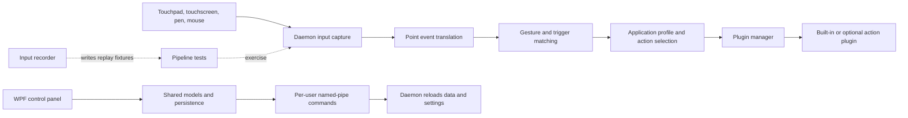

# Architecture

GestureSign separates raw device capture, gesture recognition, application-profile selection, and action execution. The daemon runs the live input path, while the control panel edits shared configuration and asks the daemon to reload it.

## Runtime flow

The daemon starts the capture and trigger managers, loads saved gestures and applications, initializes plugins, then enters its WinForms message loop (`GestureSign.Daemon/Program.cs`). `GestureSign.Daemon/Input/MessageWindow.cs` receives raw input. `GestureSign.Daemon/Input/RawInputProcessor.cs` decodes digitizer reports; `GestureSign.Daemon/Input/PointEventTranslator.cs` turns frames and mouse-hook events into point events; and `GestureSign.Daemon/Input/PointCapture.cs` owns the active stroke and recognition lifecycle.

`GestureSign.Common/Gestures/GestureManager.cs` matches captured paths against saved patterns. `GestureSign.Common/Applications/ApplicationManager.cs` selects the application profile for the target window. `GestureSign.Common/Plugins/PluginManager.cs` resolves enabled commands to plugin implementations and executes them. The control panel edits those same shared models. Its save events are sent to the daemon through command definitions in `GestureSign.Common/InterProcessCommunication/IpcCommands.cs`.

## Projects and boundaries

| Project | Responsibility |
| --- | --- |
| `GestureSign.Daemon/GestureSign.Daemon.csproj` | WinForms process for device capture, gesture execution, triggers, overlays, and tray lifecycle. |
| `GestureSign.ControlPanel/GestureSign.ControlPanel.csproj` | WPF editor for profiles, gestures, actions, plugin settings, and application options. |
| `GestureSign.InputRecorder/GestureSign.InputRecorder.csproj` | Optional recorder for raw HID and mouse input used to create reproducible test fixtures. |
| `GestureSign.Common/GestureSign.Common.csproj` | Shared models, managers, configuration, localization, IPC, and plugin contracts. |
| `GestureSign.PointPatterns/GestureSign.PointPatterns.csproj` | Point interpolation and geometric gesture matching. |
| `GestureSign.CorePlugins/GestureSign.CorePlugins.csproj` | Built-in actions for keyboard, mouse, process, audio, display, and gesture control. |
| `GestureSign.ExtraPlugins/ClipboardMatch/ClipboardMatch.csproj` and `GestureSign.ExtraPlugins/TextCopyer/TextCopyer.csproj` | Separately built optional plugins. |
| `ManagedWinapi/ManagedWinapi.csproj` and `WindowsInput/WindowsInput.csproj` | Win32 wrappers and synthetic keyboard/mouse input. |
| `GestureSign.Tests/GestureSign.Tests.csproj` | xUnit tests for HID decoding, capture, recognition, recorder data, and replay. |

The projects use C# and XAML. The UI is WPF; the daemon and recorder use WinForms and Win32 interop. Project-specific details are in [Applications](../apps/index.md) and [Libraries](../libraries/index.md).

## Process boundary and state

The daemon and control panel use separate named-pipe servers. Pipe names include the Windows user SID (`GestureSign.Common/InterProcessCommunication/NamedPipe.cs`). The shared IPC layer carries reload and training commands; it is not a network API. Application definitions, gesture patterns, continuous-gesture entries, and preferences are stored under the user profile by default. Portable builds use a local `AppData` directory. See [saved data](../reference/data-models.md) and [configuration](../reference/configuration.md).

The recorder captures device reports and mouse events without requiring the daemon. Tests replay those recordings through the same decoder, translator, and capture logic using fake operating-system services. This keeps most input-pipeline behavior testable without a physical touch device; UIAccess pointer interception and hardware-specific behavior still need manual testing.

## Further reading

- [Device gestures](../features/device-gestures.md) explains device decoding and recognition.
- [Application-aware actions](../features/application-aware-actions.md) covers profile selection.
- [Plugin actions](../features/plugin-actions.md) covers command execution.
- [IPC and security](../security.md) documents the local process boundary.